# Kith v1 — Entity Relationship Diagram

> **27 tables** | PostgreSQL 16+ | Elixir/Phoenix migrations
>
> Every table includes `id bigserial PRIMARY KEY`, `inserted_at timestamptz NOT NULL DEFAULT now()`,
> `updated_at timestamptz NOT NULL DEFAULT now()` unless explicitly noted otherwise.

---

## Mermaid ER Diagram

```mermaid
erDiagram

    accounts ||--o{ users : "has many"
    accounts ||--o{ contacts : "has many"
    accounts ||--o{ invitations : "has many"
    accounts ||--o{ tags : "has many"
    accounts ||--o{ addresses : "has many"
    accounts ||--o{ contact_fields : "has many"
    accounts ||--o{ contact_field_types : "has many (or NULL=global)"
    accounts ||--o{ relationship_types : "has many (or NULL=global)"
    accounts ||--o{ relationships : "has many"
    accounts ||--o{ genders : "has many (or NULL=global)"
    accounts ||--o{ emotions : "has many (or NULL=global)"
    accounts ||--o{ activity_type_categories : "has many (or NULL=global)"
    accounts ||--o{ life_event_types : "has many (or NULL=global)"
    accounts ||--o{ notes : "has many"
    accounts ||--o{ documents : "has many"
    accounts ||--o{ photos : "has many"
    accounts ||--o{ life_events : "has many"
    accounts ||--o{ activities : "has many"
    accounts ||--o{ calls : "has many"
    accounts ||--o{ reminders : "has many"
    accounts ||--o{ reminder_instances : "has many"
    accounts ||--o{ audit_logs : "has many"

    users ||--o{ user_tokens : "has many"
    users ||--o{ invitations : "invited_by"
    users o|--o| contacts : "me_contact"

    contacts ||--o{ addresses : "has many"
    contacts ||--o{ contact_fields : "has many"
    contacts ||--o{ relationships : "contact"
    contacts ||--o{ relationships : "related_contact"
    contacts ||--o{ contact_tags : "has many"
    contacts ||--o{ notes : "has many"
    contacts ||--o{ documents : "has many"
    contacts ||--o{ photos : "has many"
    contacts ||--o{ life_events : "has many"
    contacts ||--o{ activity_contacts : "has many"
    contacts ||--o{ calls : "has many"
    contacts ||--o{ reminders : "has many"
    contacts o|--o| genders : "belongs to"

    contact_field_types ||--o{ contact_fields : "has many"
    relationship_types ||--o{ relationships : "has many"
    tags ||--o{ contact_tags : "has many"
    life_event_types ||--o{ life_events : "has many"
    activity_type_categories ||--o{ activities : "has many"
    emotions ||--o{ activities : "has many"
    emotions ||--o{ calls : "has many"
    activities ||--o{ activity_contacts : "has many"
    reminders ||--o{ reminder_rules : "has many"
    reminders ||--o{ reminder_instances : "has many"

    audit_logs }o--|| accounts : "belongs to"
    audit_logs }o--o| users : "actor"

    accounts {
        bigserial id PK
        string name
        string timezone
        string locale
        integer send_hour
        string immich_base_url
        string immich_api_key
        string immich_status
        integer immich_consecutive_failures
        utc_datetime immich_last_synced_at
        jsonb feature_flags
    }

    users {
        bigserial id PK
        bigint account_id FK
        string email
        string hashed_password
        string role
        string display_name
        string timezone
        string locale
        string currency
        string temperature_unit
        bigint me_contact_id FK
        utc_datetime confirmed_at
        binary totp_secret
        boolean totp_enabled
        boolean webauthn_enabled
    }

    user_tokens {
        bigserial id PK
        bigint user_id FK
        binary token
        string context
        string sent_to
    }

    invitations {
        bigserial id PK
        bigint account_id FK
        bigint invited_by_id FK
        string email
        string role
        string token
        utc_datetime accepted_at
    }

    contacts {
        bigserial id PK
        bigint account_id FK
        string first_name
        string last_name
        string display_name
        string nickname
        bigint gender_id FK
        date birthdate
        text description
        string avatar
        string occupation
        string company
        boolean favorite
        boolean archived
        boolean deceased
        utc_datetime last_talked_to
        utc_datetime deleted_at
        string immich_person_id
        string immich_person_url
        string immich_status
        jsonb immich_candidates
        utc_datetime immich_last_synced_at
    }

    addresses {
        bigserial id PK
        bigint contact_id FK
        bigint account_id FK
        string label
        string street
        string city
        string province
        string postal_code
        string country
        decimal latitude
        decimal longitude
    }

    contact_fields {
        bigserial id PK
        bigint contact_id FK
        bigint account_id FK
        bigint contact_field_type_id FK
        string data
        string label
    }

    contact_field_types {
        bigserial id PK
        bigint account_id FK
        string name
        string protocol
        string icon
    }

    relationship_types {
        bigserial id PK
        bigint account_id FK
        string name
        string name_reverse_relationship
    }

    relationships {
        bigserial id PK
        bigint account_id FK
        bigint contact_id FK
        bigint related_contact_id FK
        bigint relationship_type_id FK
    }

    tags {
        bigserial id PK
        bigint account_id FK
        string name
    }

    contact_tags {
        bigint contact_id FK
        bigint tag_id FK
    }

    genders {
        bigserial id PK
        bigint account_id FK
        string name
    }

    emotions {
        bigserial id PK
        bigint account_id FK
        string name
    }

    activity_type_categories {
        bigserial id PK
        bigint account_id FK
        string name
    }

    life_event_types {
        bigserial id PK
        bigint account_id FK
        string name
    }

    notes {
        bigserial id PK
        bigint contact_id FK
        bigint account_id FK
        text body
        boolean favorite
        boolean private
    }

    documents {
        bigserial id PK
        bigint contact_id FK
        bigint account_id FK
        string file_name
        string file_path
        integer file_size
        string content_type
    }

    photos {
        bigserial id PK
        bigint contact_id FK
        bigint account_id FK
        string file_name
        string file_path
        integer file_size
        string content_type
    }

    life_events {
        bigserial id PK
        bigint contact_id FK
        bigint account_id FK
        bigint life_event_type_id FK
        string name
        text description
        date happened_at
    }

    activities {
        bigserial id PK
        bigint account_id FK
        bigint activity_type_category_id FK
        string title
        text description
        date happened_at
        bigint emotion_id FK
    }

    activity_contacts {
        bigint activity_id FK
        bigint contact_id FK
    }

    calls {
        bigserial id PK
        bigint contact_id FK
        bigint account_id FK
        text description
        utc_datetime called_at
        bigint emotion_id FK
    }

    reminders {
        bigserial id PK
        bigint contact_id FK
        bigint account_id FK
        string reminder_type
        string title
        text description
        date initial_date
        string frequency_type
        integer frequency_number
        jsonb enqueued_oban_job_ids
        boolean active
    }

    reminder_rules {
        bigserial id PK
        bigint reminder_id FK
        integer number_of_days_before
    }

    reminder_instances {
        bigserial id PK
        bigint reminder_id FK
        bigint account_id FK
        utc_datetime scheduled_at
        utc_datetime triggered_at
        string status
    }

    audit_logs {
        bigserial id PK
        bigint account_id FK
        bigint actor_id FK
        integer contact_id
        string contact_name
        string action
        string auditable_type
        integer auditable_id
        jsonb metadata
    }
```

---

## Table Definitions

### 1. `accounts`

Tenant/workspace root. Every entity ultimately belongs to an account.

| Column | Postgres Type | Nullable | Default | Constraints |
|---|---|---|---|---|
| `id` | `bigserial` | NO | auto | `PRIMARY KEY` |
| `name` | `varchar(255)` | NO | — | |
| `timezone` | `varchar(255)` | NO | `'UTC'` | |
| `locale` | `varchar(255)` | NO | `'en'` | |
| `send_hour` | `integer` | NO | `9` | CHECK (send_hour >= 0 AND send_hour <= 23) |
| `immich_base_url` | `varchar(255)` | YES | `NULL` | |
| `immich_api_key` | `varchar(255)` | YES | `NULL` | Encrypted at application layer |
| `immich_status` | `varchar(255)` | NO | `'disabled'` | CHECK (immich_status IN ('disabled', 'ok', 'error')) |
| `immich_consecutive_failures` | `integer` | NO | `0` | |
| `immich_last_synced_at` | `timestamptz` | YES | `NULL` | |
| `feature_flags` | `jsonb` | NO | `'{}'` | |
| `inserted_at` | `timestamptz` | NO | `now()` | |
| `updated_at` | `timestamptz` | NO | `now()` | |

**Indexes:** none beyond PK.

---

### 2. `users`

| Column | Postgres Type | Nullable | Default | Constraints |
|---|---|---|---|---|
| `id` | `bigserial` | NO | auto | `PRIMARY KEY` |
| `account_id` | `bigint` | NO | — | `FK → accounts(id) ON DELETE CASCADE` |
| `email` | `citext` | NO | — | `UNIQUE` |
| `hashed_password` | `varchar(255)` | NO | — | |
| `role` | `varchar(255)` | NO | `'admin'` | CHECK (role IN ('admin', 'editor', 'viewer')) |
| `display_name` | `varchar(255)` | YES | `NULL` | |
| `timezone` | `varchar(255)` | YES | `NULL` | Overrides account timezone |
| `locale` | `varchar(255)` | YES | `NULL` | Overrides account locale |
| `currency` | `varchar(255)` | YES | `NULL` | |
| `temperature_unit` | `varchar(255)` | NO | `'celsius'` | CHECK (temperature_unit IN ('celsius', 'fahrenheit')) |
| `me_contact_id` | `bigint` | YES | `NULL` | `FK → contacts(id) ON DELETE SET NULL` |
| `confirmed_at` | `timestamptz` | YES | `NULL` | |
| `totp_secret` | `bytea` | YES | `NULL` | Encrypted at application layer |
| `totp_enabled` | `boolean` | NO | `false` | |
| `webauthn_enabled` | `boolean` | NO | `false` | |
| `inserted_at` | `timestamptz` | NO | `now()` | |
| `updated_at` | `timestamptz` | NO | `now()` | |

**Indexes:**

- `users_email_index` — UNIQUE on `(email)`
- `users_account_id_index` — on `(account_id)`

---

### 3. `user_tokens`

| Column | Postgres Type | Nullable | Default | Constraints |
|---|---|---|---|---|
| `id` | `bigserial` | NO | auto | `PRIMARY KEY` |
| `user_id` | `bigint` | NO | — | `FK → users(id) ON DELETE CASCADE` |
| `token` | `bytea` | NO | — | |
| `context` | `varchar(255)` | NO | — | |
| `sent_to` | `varchar(255)` | YES | `NULL` | Email address for email tokens |
| `inserted_at` | `timestamptz` | NO | `now()` | |
| `updated_at` | `timestamptz` | NO | `now()` | |

**Indexes:**

- `user_tokens_context_token_index` — UNIQUE on `(context, token)`
- `user_tokens_user_id_index` — on `(user_id)`

---

### 4. `invitations`

| Column | Postgres Type | Nullable | Default | Constraints |
|---|---|---|---|---|
| `id` | `bigserial` | NO | auto | `PRIMARY KEY` |
| `account_id` | `bigint` | NO | — | `FK → accounts(id) ON DELETE CASCADE` |
| `invited_by_id` | `bigint` | NO | — | `FK → users(id) ON DELETE CASCADE` |
| `email` | `varchar(255)` | NO | — | |
| `role` | `varchar(255)` | NO | `'viewer'` | CHECK (role IN ('admin', 'editor', 'viewer')) |
| `token` | `varchar(255)` | NO | — | `UNIQUE` |
| `accepted_at` | `timestamptz` | YES | `NULL` | |
| `inserted_at` | `timestamptz` | NO | `now()` | |
| `updated_at` | `timestamptz` | NO | `now()` | |

**Indexes:**

- `invitations_token_index` — UNIQUE on `(token)`
- `invitations_account_id_email_index` — UNIQUE on `(account_id, email)`

---

### 5. `contacts`

Central hub entity. **Supports soft-delete via `deleted_at`.**

| Column | Postgres Type | Nullable | Default | Constraints |
|---|---|---|---|---|
| `id` | `bigserial` | NO | auto | `PRIMARY KEY` |
| `account_id` | `bigint` | NO | — | `FK → accounts(id) ON DELETE CASCADE` |
| `first_name` | `varchar(255)` | NO | — | |
| `last_name` | `varchar(255)` | YES | `NULL` | |
| `display_name` | `varchar(255)` | YES | `NULL` | Computed or overridden |
| `nickname` | `varchar(255)` | YES | `NULL` | |
| `gender_id` | `bigint` | YES | `NULL` | `FK → genders(id) ON DELETE SET NULL` |
| `birthdate` | `date` | YES | `NULL` | |
| `description` | `text` | YES | `NULL` | |
| `avatar` | `varchar(255)` | YES | `NULL` | File path |
| `occupation` | `varchar(255)` | YES | `NULL` | |
| `company` | `varchar(255)` | YES | `NULL` | |
| `favorite` | `boolean` | NO | `false` | |
| `archived` | `boolean` | NO | `false` | |
| `deceased` | `boolean` | NO | `false` | |
| `last_talked_to` | `timestamptz` | YES | `NULL` | |
| `deleted_at` | `timestamptz` | YES | `NULL` | Soft-delete marker |
| `immich_person_id` | `varchar(255)` | YES | `NULL` | |
| `immich_person_url` | `varchar(255)` | YES | `NULL` | |
| `immich_status` | `varchar(255)` | NO | `'unlinked'` | CHECK (immich_status IN ('unlinked', 'needs_review', 'linked')) |
| `immich_candidates` | `jsonb` | NO | `'[]'` | |
| `immich_last_synced_at` | `timestamptz` | YES | `NULL` | |
| `inserted_at` | `timestamptz` | NO | `now()` | |
| `updated_at` | `timestamptz` | NO | `now()` | |

**Indexes:**

- `contacts_active_idx` — partial on `(account_id)` WHERE `deleted_at IS NULL`
- `contacts_trash_idx` — partial on `(account_id, deleted_at)` WHERE `deleted_at IS NOT NULL`
- `contacts_account_id_last_name_first_name_index` — on `(account_id, last_name, first_name)`
- `contacts_gender_id_index` — on `(gender_id)`

---

### 6. `addresses`

| Column | Postgres Type | Nullable | Default | Constraints |
|---|---|---|---|---|
| `id` | `bigserial` | NO | auto | `PRIMARY KEY` |
| `contact_id` | `bigint` | NO | — | `FK → contacts(id) ON DELETE CASCADE` |
| `account_id` | `bigint` | NO | — | `FK → accounts(id) ON DELETE CASCADE` |
| `label` | `varchar(255)` | YES | `NULL` | e.g. "Home", "Work" |
| `street` | `varchar(255)` | YES | `NULL` | |
| `city` | `varchar(255)` | YES | `NULL` | |
| `province` | `varchar(255)` | YES | `NULL` | |
| `postal_code` | `varchar(255)` | YES | `NULL` | |
| `country` | `varchar(255)` | YES | `NULL` | |
| `latitude` | `numeric` | YES | `NULL` | |
| `longitude` | `numeric` | YES | `NULL` | |
| `inserted_at` | `timestamptz` | NO | `now()` | |
| `updated_at` | `timestamptz` | NO | `now()` | |

**Indexes:**

- `addresses_contact_id_index` — on `(contact_id)`
- `addresses_account_id_index` — on `(account_id)`

---

### 7. `contact_fields`

| Column | Postgres Type | Nullable | Default | Constraints |
|---|---|---|---|---|
| `id` | `bigserial` | NO | auto | `PRIMARY KEY` |
| `contact_id` | `bigint` | NO | — | `FK → contacts(id) ON DELETE CASCADE` |
| `account_id` | `bigint` | NO | — | `FK → accounts(id) ON DELETE CASCADE` |
| `contact_field_type_id` | `bigint` | NO | — | `FK → contact_field_types(id) ON DELETE CASCADE` |
| `data` | `varchar(255)` | NO | — | |
| `label` | `varchar(255)` | YES | `NULL` | |
| `inserted_at` | `timestamptz` | NO | `now()` | |
| `updated_at` | `timestamptz` | NO | `now()` | |

**Indexes:**

- `contact_fields_contact_id_index` — on `(contact_id)`
- `contact_fields_contact_field_type_id_index` — on `(contact_field_type_id)`

---

### 8. `contact_field_types`

Reference data. Rows with `account_id = NULL` are global defaults; per-account rows override.

| Column | Postgres Type | Nullable | Default | Constraints |
|---|---|---|---|---|
| `id` | `bigserial` | NO | auto | `PRIMARY KEY` |
| `account_id` | `bigint` | YES | `NULL` | `FK → accounts(id) ON DELETE CASCADE` |
| `name` | `varchar(255)` | NO | — | |
| `protocol` | `varchar(255)` | YES | `NULL` | e.g. "mailto:", "tel:", "https://" |
| `icon` | `varchar(255)` | YES | `NULL` | |
| `inserted_at` | `timestamptz` | NO | `now()` | |
| `updated_at` | `timestamptz` | NO | `now()` | |

**Indexes:**

- `contact_field_types_account_id_name_index` — UNIQUE on `(COALESCE(account_id, 0), name)`

> **Note:** The unique index uses `COALESCE(account_id, 0)` to handle NULL account_id values
> for global defaults, since standard unique constraints treat NULLs as distinct.

---

### 9. `relationship_types`

Reference data. Rows with `account_id = NULL` are global defaults.

| Column | Postgres Type | Nullable | Default | Constraints |
|---|---|---|---|---|
| `id` | `bigserial` | NO | auto | `PRIMARY KEY` |
| `account_id` | `bigint` | YES | `NULL` | `FK → accounts(id) ON DELETE CASCADE` |
| `name` | `varchar(255)` | NO | — | |
| `name_reverse_relationship` | `varchar(255)` | NO | — | |
| `inserted_at` | `timestamptz` | NO | `now()` | |
| `updated_at` | `timestamptz` | NO | `now()` | |

**Indexes:**

- `relationship_types_account_id_name_index` — UNIQUE on `(COALESCE(account_id, 0), name)`

---

### 10. `relationships`

| Column | Postgres Type | Nullable | Default | Constraints |
|---|---|---|---|---|
| `id` | `bigserial` | NO | auto | `PRIMARY KEY` |
| `account_id` | `bigint` | NO | — | `FK → accounts(id) ON DELETE CASCADE` |
| `contact_id` | `bigint` | NO | — | `FK → contacts(id) ON DELETE CASCADE` |
| `related_contact_id` | `bigint` | NO | — | `FK → contacts(id) ON DELETE CASCADE` |
| `relationship_type_id` | `bigint` | NO | — | `FK → relationship_types(id) ON DELETE CASCADE` |
| `inserted_at` | `timestamptz` | NO | `now()` | |
| `updated_at` | `timestamptz` | NO | `now()` | |

**Indexes:**

- `relationships_unique_index` — UNIQUE on `(account_id, contact_id, related_contact_id, relationship_type_id)`
- `relationships_contact_id_index` — on `(contact_id)`
- `relationships_related_contact_id_index` — on `(related_contact_id)`

---

### 11. `tags`

| Column | Postgres Type | Nullable | Default | Constraints |
|---|---|---|---|---|
| `id` | `bigserial` | NO | auto | `PRIMARY KEY` |
| `account_id` | `bigint` | NO | — | `FK → accounts(id) ON DELETE CASCADE` |
| `name` | `varchar(255)` | NO | — | |
| `inserted_at` | `timestamptz` | NO | `now()` | |
| `updated_at` | `timestamptz` | NO | `now()` | |

**Indexes:**

- `tags_account_id_name_index` — UNIQUE on `(account_id, name)`

---

### 12. `contact_tags`

Pure join table. **No `id`, `inserted_at`, or `updated_at` columns.**

| Column | Postgres Type | Nullable | Default | Constraints |
|---|---|---|---|---|
| `contact_id` | `bigint` | NO | — | `FK → contacts(id) ON DELETE CASCADE` |
| `tag_id` | `bigint` | NO | — | `FK → tags(id) ON DELETE CASCADE` |

**Primary Key:** composite `(contact_id, tag_id)`

**Indexes:**

- `contact_tags_contact_id_tag_id_index` — UNIQUE on `(contact_id, tag_id)` (enforced by PK)
- `contact_tags_tag_id_index` — on `(tag_id)`

---

### 13. `genders`

Reference data. Rows with `account_id = NULL` are global defaults.

| Column | Postgres Type | Nullable | Default | Constraints |
|---|---|---|---|---|
| `id` | `bigserial` | NO | auto | `PRIMARY KEY` |
| `account_id` | `bigint` | YES | `NULL` | `FK → accounts(id) ON DELETE CASCADE` |
| `name` | `varchar(255)` | NO | — | |
| `inserted_at` | `timestamptz` | NO | `now()` | |
| `updated_at` | `timestamptz` | NO | `now()` | |

**Indexes:**

- `genders_account_id_name_index` — UNIQUE on `(COALESCE(account_id, 0), name)`

---

### 14. `emotions`

Reference data, seeded. Rows with `account_id = NULL` are global defaults.

| Column | Postgres Type | Nullable | Default | Constraints |
|---|---|---|---|---|
| `id` | `bigserial` | NO | auto | `PRIMARY KEY` |
| `account_id` | `bigint` | YES | `NULL` | `FK → accounts(id) ON DELETE CASCADE` |
| `name` | `varchar(255)` | NO | — | |
| `inserted_at` | `timestamptz` | NO | `now()` | |
| `updated_at` | `timestamptz` | NO | `now()` | |

**Indexes:**

- `emotions_account_id_name_index` — UNIQUE on `(COALESCE(account_id, 0), name)`

---

### 15. `activity_type_categories`

Reference data, seeded. Rows with `account_id = NULL` are global defaults.

| Column | Postgres Type | Nullable | Default | Constraints |
|---|---|---|---|---|
| `id` | `bigserial` | NO | auto | `PRIMARY KEY` |
| `account_id` | `bigint` | YES | `NULL` | `FK → accounts(id) ON DELETE CASCADE` |
| `name` | `varchar(255)` | NO | — | |
| `inserted_at` | `timestamptz` | NO | `now()` | |
| `updated_at` | `timestamptz` | NO | `now()` | |

**Indexes:**

- `activity_type_categories_account_id_name_index` — UNIQUE on `(COALESCE(account_id, 0), name)`

---

### 16. `life_event_types`

Reference data, seeded. Rows with `account_id = NULL` are global defaults.

| Column | Postgres Type | Nullable | Default | Constraints |
|---|---|---|---|---|
| `id` | `bigserial` | NO | auto | `PRIMARY KEY` |
| `account_id` | `bigint` | YES | `NULL` | `FK → accounts(id) ON DELETE CASCADE` |
| `name` | `varchar(255)` | NO | — | |
| `inserted_at` | `timestamptz` | NO | `now()` | |
| `updated_at` | `timestamptz` | NO | `now()` | |

**Indexes:**

- `life_event_types_account_id_name_index` — UNIQUE on `(COALESCE(account_id, 0), name)`

---

### 17. `notes`

| Column | Postgres Type | Nullable | Default | Constraints |
|---|---|---|---|---|
| `id` | `bigserial` | NO | auto | `PRIMARY KEY` |
| `contact_id` | `bigint` | NO | — | `FK → contacts(id) ON DELETE CASCADE` |
| `account_id` | `bigint` | NO | — | `FK → accounts(id) ON DELETE CASCADE` |
| `body` | `text` | NO | — | |
| `favorite` | `boolean` | NO | `false` | |
| `private` | `boolean` | NO | `false` | |
| `inserted_at` | `timestamptz` | NO | `now()` | |
| `updated_at` | `timestamptz` | NO | `now()` | |

**Indexes:**

- `notes_contact_id_index` — on `(contact_id)`
- `notes_account_id_index` — on `(account_id)`

---

### 18. `documents`

| Column | Postgres Type | Nullable | Default | Constraints |
|---|---|---|---|---|
| `id` | `bigserial` | NO | auto | `PRIMARY KEY` |
| `contact_id` | `bigint` | NO | — | `FK → contacts(id) ON DELETE CASCADE` |
| `account_id` | `bigint` | NO | — | `FK → accounts(id) ON DELETE CASCADE` |
| `file_name` | `varchar(255)` | NO | — | |
| `file_path` | `varchar(255)` | NO | — | |
| `file_size` | `integer` | NO | — | |
| `content_type` | `varchar(255)` | NO | — | |
| `inserted_at` | `timestamptz` | NO | `now()` | |
| `updated_at` | `timestamptz` | NO | `now()` | |

**Indexes:**

- `documents_contact_id_index` — on `(contact_id)`

---

### 19. `photos`

| Column | Postgres Type | Nullable | Default | Constraints |
|---|---|---|---|---|
| `id` | `bigserial` | NO | auto | `PRIMARY KEY` |
| `contact_id` | `bigint` | NO | — | `FK → contacts(id) ON DELETE CASCADE` |
| `account_id` | `bigint` | NO | — | `FK → accounts(id) ON DELETE CASCADE` |
| `file_name` | `varchar(255)` | NO | — | |
| `file_path` | `varchar(255)` | NO | — | |
| `file_size` | `integer` | NO | — | |
| `content_type` | `varchar(255)` | NO | — | |
| `inserted_at` | `timestamptz` | NO | `now()` | |
| `updated_at` | `timestamptz` | NO | `now()` | |

**Indexes:**

- `photos_contact_id_index` — on `(contact_id)`

---

### 20. `life_events`

| Column | Postgres Type | Nullable | Default | Constraints |
|---|---|---|---|---|
| `id` | `bigserial` | NO | auto | `PRIMARY KEY` |
| `contact_id` | `bigint` | NO | — | `FK → contacts(id) ON DELETE CASCADE` |
| `account_id` | `bigint` | NO | — | `FK → accounts(id) ON DELETE CASCADE` |
| `life_event_type_id` | `bigint` | NO | — | `FK → life_event_types(id) ON DELETE CASCADE` |
| `name` | `varchar(255)` | NO | — | |
| `description` | `text` | YES | `NULL` | |
| `happened_at` | `date` | NO | — | |
| `inserted_at` | `timestamptz` | NO | `now()` | |
| `updated_at` | `timestamptz` | NO | `now()` | |

**Indexes:**

- `life_events_contact_id_index` — on `(contact_id)`
- `life_events_life_event_type_id_index` — on `(life_event_type_id)`

---

### 21. `activities`

| Column | Postgres Type | Nullable | Default | Constraints |
|---|---|---|---|---|
| `id` | `bigserial` | NO | auto | `PRIMARY KEY` |
| `account_id` | `bigint` | NO | — | `FK → accounts(id) ON DELETE CASCADE` |
| `activity_type_category_id` | `bigint` | YES | `NULL` | `FK → activity_type_categories(id) ON DELETE SET NULL` |
| `title` | `varchar(255)` | NO | — | |
| `description` | `text` | YES | `NULL` | |
| `happened_at` | `date` | NO | — | |
| `emotion_id` | `bigint` | YES | `NULL` | `FK → emotions(id) ON DELETE SET NULL` |
| `inserted_at` | `timestamptz` | NO | `now()` | |
| `updated_at` | `timestamptz` | NO | `now()` | |

**Indexes:**

- `activities_account_id_index` — on `(account_id)`
- `activities_activity_type_category_id_index` — on `(activity_type_category_id)`
- `activities_emotion_id_index` — on `(emotion_id)`

---

### 22. `activity_contacts`

Pure join table. **No `id`, `inserted_at`, or `updated_at` columns.**

| Column | Postgres Type | Nullable | Default | Constraints |
|---|---|---|---|---|
| `activity_id` | `bigint` | NO | — | `FK → activities(id) ON DELETE CASCADE` |
| `contact_id` | `bigint` | NO | — | `FK → contacts(id) ON DELETE CASCADE` |

**Primary Key:** composite `(activity_id, contact_id)`

**Indexes:**

- `activity_contacts_activity_id_contact_id_index` — UNIQUE on `(activity_id, contact_id)` (enforced by PK)

---

### 23. `calls`

| Column | Postgres Type | Nullable | Default | Constraints |
|---|---|---|---|---|
| `id` | `bigserial` | NO | auto | `PRIMARY KEY` |
| `contact_id` | `bigint` | NO | — | `FK → contacts(id) ON DELETE CASCADE` |
| `account_id` | `bigint` | NO | — | `FK → accounts(id) ON DELETE CASCADE` |
| `description` | `text` | YES | `NULL` | |
| `called_at` | `timestamptz` | NO | — | |
| `emotion_id` | `bigint` | YES | `NULL` | `FK → emotions(id) ON DELETE SET NULL` |
| `inserted_at` | `timestamptz` | NO | `now()` | |
| `updated_at` | `timestamptz` | NO | `now()` | |

**Indexes:**

- `calls_contact_id_index` — on `(contact_id)`
- `calls_account_id_index` — on `(account_id)`

---

### 24. `reminders`

| Column | Postgres Type | Nullable | Default | Constraints |
|---|---|---|---|---|
| `id` | `bigserial` | NO | auto | `PRIMARY KEY` |
| `contact_id` | `bigint` | NO | — | `FK → contacts(id) ON DELETE CASCADE` |
| `account_id` | `bigint` | NO | — | `FK → accounts(id) ON DELETE CASCADE` |
| `reminder_type` | `varchar(255)` | NO | — | CHECK (reminder_type IN ('birthday', 'stay_in_touch', 'one_time', 'recurring')) |
| `title` | `varchar(255)` | YES | `NULL` | |
| `description` | `text` | YES | `NULL` | |
| `initial_date` | `date` | NO | — | |
| `frequency_type` | `varchar(255)` | YES | `NULL` | CHECK (frequency_type IN ('weekly', 'monthly', 'yearly') OR frequency_type IS NULL) |
| `frequency_number` | `integer` | YES | `NULL` | |
| `enqueued_oban_job_ids` | `jsonb` | NO | `'[]'` | |
| `active` | `boolean` | NO | `true` | |
| `inserted_at` | `timestamptz` | NO | `now()` | |
| `updated_at` | `timestamptz` | NO | `now()` | |

**Indexes:**

- `reminders_contact_id_index` — on `(contact_id)`
- `reminders_account_id_index` — on `(account_id)`
- `reminders_reminder_type_index` — on `(reminder_type)`

---

### 25. `reminder_rules`

| Column | Postgres Type | Nullable | Default | Constraints |
|---|---|---|---|---|
| `id` | `bigserial` | NO | auto | `PRIMARY KEY` |
| `reminder_id` | `bigint` | NO | — | `FK → reminders(id) ON DELETE CASCADE` |
| `number_of_days_before` | `integer` | NO | — | |
| `inserted_at` | `timestamptz` | NO | `now()` | |
| `updated_at` | `timestamptz` | NO | `now()` | |

**Indexes:**

- `reminder_rules_reminder_id_index` — on `(reminder_id)`

---

### 26. `reminder_instances`

| Column | Postgres Type | Nullable | Default | Constraints |
|---|---|---|---|---|
| `id` | `bigserial` | NO | auto | `PRIMARY KEY` |
| `reminder_id` | `bigint` | NO | — | `FK → reminders(id) ON DELETE CASCADE` |
| `account_id` | `bigint` | NO | — | `FK → accounts(id) ON DELETE CASCADE` |
| `scheduled_at` | `timestamptz` | NO | — | |
| `triggered_at` | `timestamptz` | YES | `NULL` | |
| `status` | `varchar(255)` | NO | `'pending'` | CHECK (status IN ('pending', 'resolved', 'dismissed')) |
| `inserted_at` | `timestamptz` | NO | `now()` | |
| `updated_at` | `timestamptz` | NO | `now()` | |

**Indexes:**

- `reminder_instances_reminder_id_index` — on `(reminder_id)`
- `reminder_instances_account_id_status_index` — on `(account_id, status)`
- `reminder_instances_scheduled_at_index` — on `(scheduled_at)`

---

### 27. `audit_logs`

| Column | Postgres Type | Nullable | Default | Constraints |
|---|---|---|---|---|
| `id` | `bigserial` | NO | auto | `PRIMARY KEY` |
| `account_id` | `bigint` | NO | — | `FK → accounts(id) ON DELETE CASCADE` |
| `actor_id` | `bigint` | YES | `NULL` | `FK → users(id) ON DELETE SET NULL` |
| `contact_id` | `integer` | YES | `NULL` | **NO FOREIGN KEY** — plain integer, survives contact deletion |
| `contact_name` | `varchar(255)` | YES | `NULL` | Snapshot of contact name at event time |
| `action` | `varchar(255)` | NO | — | |
| `auditable_type` | `varchar(255)` | NO | — | |
| `auditable_id` | `integer` | NO | — | |
| `metadata` | `jsonb` | NO | `'{}'` | |
| `inserted_at` | `timestamptz` | NO | `now()` | |
| `updated_at` | `timestamptz` | NO | `now()` | |

**Indexes:**

- `audit_logs_account_id_index` — on `(account_id)`
- `audit_logs_contact_id_index` — on `(contact_id)`
- `audit_logs_actor_id_index` — on `(actor_id)`
- `audit_logs_action_index` — on `(action)`
- `audit_logs_inserted_at_index` — on `(inserted_at)`

---

## Schema Policies

### Soft-Delete

- **Only `contacts`** uses soft-delete via the `deleted_at` column.
- All other tables use hard-delete, cascading from their parent via `ON DELETE CASCADE`.
- Two partial indexes optimize queries:
  - `contacts_active_idx` — filters to `WHERE deleted_at IS NULL` (normal queries).
  - `contacts_trash_idx` — filters to `WHERE deleted_at IS NOT NULL` (trash view).

### Foreign Key ON DELETE Behavior

| Pattern | Tables | ON DELETE |
|---|---|---|
| Cascade (parent owns child) | Most FK relationships | `CASCADE` |
| Set NULL (preserve child, clear reference) | `users.me_contact_id`, `contacts.gender_id`, `activities.activity_type_category_id`, `activities.emotion_id`, `calls.emotion_id`, `audit_logs.actor_id` | `SET NULL` |
| No FK (intentional denormalization) | `audit_logs.contact_id` | N/A — plain integer column |

### Reference Data Tables

The following tables use nullable `account_id` to support both global defaults (seeded, `account_id = NULL`) and per-account customization:

- `contact_field_types`
- `relationship_types`
- `genders`
- `emotions`
- `activity_type_categories`
- `life_event_types`

This approach uses seeded rows in regular tables rather than Postgres `ENUM` types, enabling future v1.5 customization as additive migrations without `ALTER TYPE`.

### Pure Join Tables

Two tables are pure join tables with no surrogate key or timestamps:

- `contact_tags` — composite PK `(contact_id, tag_id)`
- `activity_contacts` — composite PK `(activity_id, contact_id)`

### Additive-Only Migrations

All schema changes follow an additive-only policy: no column drops, no table drops until a major version. This ensures safe rollbacks and zero-downtime deployments.

### Timestamp Convention

All tables use `inserted_at` and `updated_at` (Phoenix/Ecto convention) with type `timestamptz` and default `now()`, except pure join tables which have no timestamps.

### Encryption

Sensitive columns encrypted at the application layer (Ecto's `Cloak` library or equivalent):

- `accounts.immich_api_key`
- `users.totp_secret`

### Multi-Tenancy

Every user-facing table includes an `account_id` column (directly or transitively). All queries should scope by `account_id` to enforce tenant isolation. Reference data tables use `account_id = NULL` for global defaults shared across all tenants.
